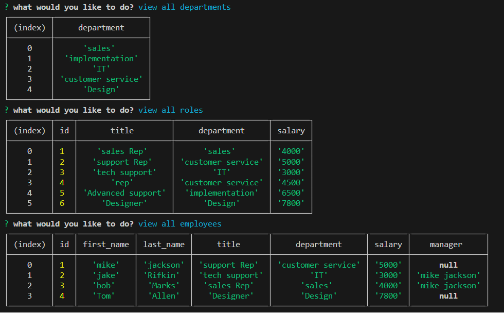

# Employee Tracker
  

  ## Description
  an aplication that keeps track of all the employees, departments and roles in a buisness in a database and makes it easy for the user to view and update data.

  ## Table of Contents 
  - [Installation](#installation)
  - [Usage](#usage)
  - [License](#license)
  - [Contributing](#contributing)
  - [Questions](#questions)

  ## Installation
  clone the respository and run 'npm i' in the terminal

  ## Usage
  run the command 'node app' in the terminal to start the application, answer the prompts, press Ctrl+C to exit the application

  

  

  [link to walkthrough video] (https://drive.google.com/file/d/1dWD7CtW_iSjQ-DrotGFxgjlUBODN8hy9/view?usp=sharing)

  ## License
  This project is licensed under MIT.

  ## Contributing
  make a pull request  in GitHub 

  ## Tests
  NA

  ## Questions
  If you have any questions about this project you can reach me at 7329424561.

  To view more of my Projects go to https://github.com/MalkaGreenberg.
